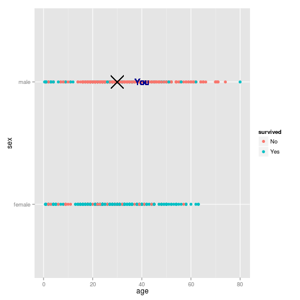

## Main Question


Imagine, that you are the Titanic passenger.

Did you have a chance for surviving?


<h2>Lets see !</h2>


---

## How to answer this question?

We comparing your data(age and sex) and our prediction. 


<h2> What is "our prediction"? </h2>

Machine Learning model based on real passenger surviving.

<h2> What is the data? </h2>

It is subset from Kaggle competition "Titanic: Machine Learning from Disaster"
You could find it here http://www.kaggle.com/c/titanic-gettingStarted.

The subset contains variables "age", "sex", "survived" and include 714 rows.


---


## How we made this prediction?
We trained a model using randomForest algorithm with ntree=50.

Suppose, your age is 30 and you sex is male.
Did you have a chance?


```
## [1] "No"
```


 


---

## How good is our prediction?


```r
require(randomForest)
tree_mod <- randomForest(survived ~ ., data = titanic, ntree = 50)
tree_mod
```

```
## 
## Call:
##  randomForest(formula = survived ~ ., data = titanic, ntree = 50) 
##                Type of random forest: classification
##                      Number of trees: 50
## No. of variables tried at each split: 1
## 
##         OOB estimate of  error rate: 21.43%
## Confusion matrix:
##      No Yes class.error
## No  353  71      0.1675
## Yes  82 208      0.2828
```


